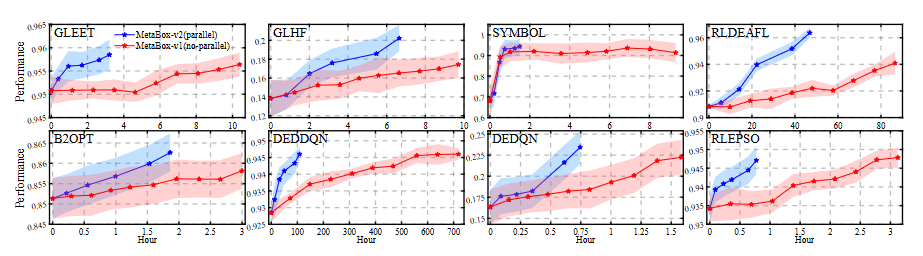
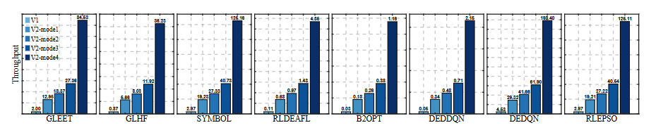

# Flexibly Leverage Parallelism
## 1. Training parallelism
<p align="center">
  
</p>

MetaBox-v2 provides [VecEnv](https://github.com/MetaEvo/MetaBox/tree/v2.0.0/src/environment/parallelenv) to support parallel sampling for the training of MetaBBO. The overall workflow is: trh Trainer will traverse each problem instance in the train split. For each problem instance, "barch_size" independent optimization environments are constructed and wrapped into a VecEnv, then VecEnv deploies "barch_size" subprocesses to concurrently promote the interactions between these optimization environments and the meta-level policy. Users might want to set larger "batch_size" to accelerate the learning process. However, it is better to set an approporiate "batch_size" considering the hardware used for the training. If your CPU has 64 cores, "batch_size" should be no more than 32 to ensure other processes in this hardware are not blocked. Below we show where to set the "batch_size".

```python

```

## 2. Testing parallelism
<p align="center">
  
</p>
There are five testing modes. "Serial" mode means we test a baseline on a testsuites in a nested loop:

```python
for problem in testsuites:
    for run in test_runs:
        baseline.rollout_episode(problem)
```

The other four modes are parallel modes using Ray to accelerate the testing process. For example, "Batch" mode means we select a batch of problem instances and distribute their currrent runs to different CPU cores:

```python
for problem_batch in testsuites:
    for run in test_runs:
        ray.distribute(baseline, problem_batch)
        # in each CPU core
        baseline.rollout_episode(problem_batch[i])
```

"Full" mode means we distribute all combination of problem instances and test runs to different CPU cores (as long as the CPU cores users have are enough). 

```python
ray.distribute(baseline, zip(testsiotes, test_runs))
# in each CPU core
baseline.rollout_episode(problem)
```

Users should select testing modes according to their hardware. Although "Full" mode introduce significant acceleration if the CPU cores are enough, it is not the case for trivial users. For other testing modes, see [Config](https://metaboxdoc.readthedocs.io/en/docs/guide/QuickStart/Config.html). 
